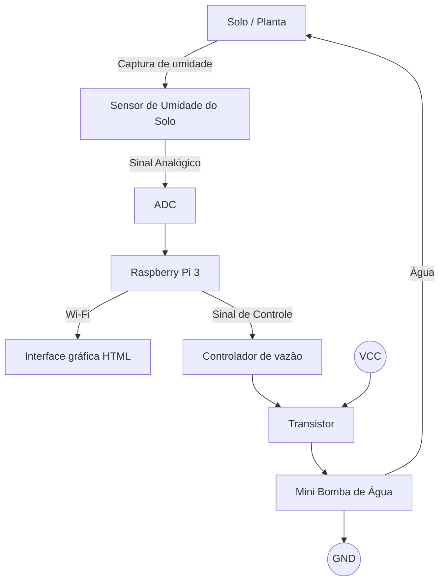
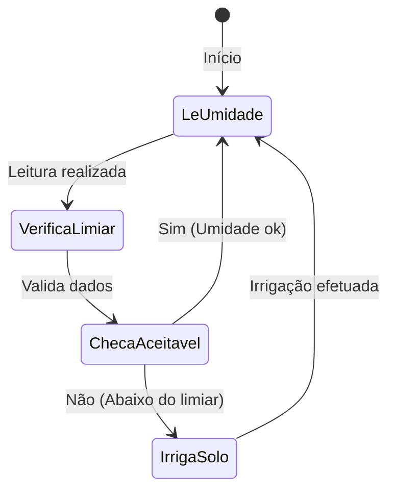

# Universidade de São Paulo - Escola Politécnica
## PCS3732 - Laboratório de Processadores

### **Projeto da disciplina:** Irrigador com monitoramento de umidade do solo

### Autores

| Nome | NUSP |
| :--- | :--- |
| André Yugo Inoue | 12551345 |
| Beatriz Barreto Tavora | 14560401 |
| João Victor Meneghelli Milanezi | 14583000 |
| Vinícius de Andrade Rosa | 14610991 |

---

## 1. Introdução

### Motivação / Justificativa
Com o objetivo de aplicar os conceitos e métodos aprendidos ao longo da disciplina PCS3732 em um contexto prático, o grupo decidiu como projeto um irrigador com monitoramento de umidade do solo. Através dele, pretende-se desenvolver um dispositivo que lide com necessidades práticas e econômicas. Seja na agricultura em pequena escala, no cultivo urbano ou em estufas, a irrigação manual ou baseada em horários fixos frequentemente comete dois erros opostos: a subirrigação, que estressa a planta e compromete seu desenvolvimento, e a superirrigação, que desperdiça recursos hídricos, expõe o solo à lixiviação de nutrientes e pode apodrecer as raízes.

O desenvolvimento de um irrigador automatizado com sensor de umidade de solo justifica-se pela busca de uma solução precisa e de baixo custo. Ao substituir o acionamento por horários predeterminados pelo monitoramento do estado real do substrato, o sistema garante que a água seja aplicada apenas quando e quanto a planta realmente necessita, otimizando o consumo de água e reduzindo o trabalho manual recorrente.

---

## 2. Objetivos do Projeto

### Objetivo Geral
Projetar e construir um sistema automatizado de irrigação de solo que utilize sensores de umidade para controlar de forma autônoma o acionamento de um atuador hídrico, mantendo o solo na faixa de umidade ideal para o cultivo.

### Objetivos Específicos
- Integrar um sensor de umidade ao microcontrolador para obter leituras em tempo real e calibrar os limiares críticos de solo seco e solo úmido.
- Desenvolver a rotina de controle responsável por interpretar os dados do sensor e tomar a decisão de ligar ou desligar o mecanismo de irrigação.
- Implementar temporizadores e travas no código para evitar acionamentos contínuos em caso de falha de leitura, impedindo o encharcamento acidental.
- Estruturar o circuito com foco em baixo consumo de energia e facilidade de manutenção, viabilizando o uso em ambientes de cultivo contínuo.

---

## 3. Requisitos

| Código | Nome do Requisito | Tipo | Descrição |
| :--- | :--- | :--- | :--- |
| **RF-1** | Monitoramento da Umidade do Solo | Funcional | O sistema deve realizar leituras periódicas do sensor de umidade para determinar o estado hídrico do solo. |
| **RF-2** | Irrigação Automática | Funcional | O sistema deve acionar automaticamente a bomba de água quando a umidade medida estiver abaixo de um limiar configurado. |
| **RF-3** | Visualização do Estado do Sistema | Funcional | O sistema deve disponibilizar ao usuário informações como nível de umidade, estado da bomba e histórico recente de leituras por meio de uma interface web ou display. |
| **RF-4** | Visualização de Série Temporal | Funcional | O sistema deve disponibilizar a série temporal das leituras em forma gráfica. |
| **RNF-1** | Tempo de Resposta | Não Funcional (Eficiência de Desempenho) | O sistema deve acionar a irrigação em até 5 segundos após detectar um nível de umidade inferior ao limiar configurado. |
| **RNF-2** | Confiabilidade Operacional | Não Funcional (Confiabilidade) | O sistema deve operar continuamente durante períodos prolongados sem falhas de leitura ou acionamento indevido da bomba. |
| **RNF-3** | Facilidade de Configuração | Não Funcional (Usabilidade) | O usuário deve conseguir alterar parâmetros como limiar de umidade e intervalo de amostragem sem necessidade de modificar o código-fonte. |

---

## 4. Arquitetura

O hardware do sistema é centrado no Raspberry Pi 3, que atua como unidade central de processamento, conectando sensores, atuadores e a camada de monitoramento do usuário. Sensores de umidade do solo fazem a leitura do nível de água no substrato da planta e enviam o sinal analógico para um conversor analógico-digital, que por sua vez adequa o sinal para ser lido pelos pinos GPIO do Raspberry Pi. Para acionar uma das bombas de água, o Raspberry Pi envia um sinal de controle através do controlador de vazão até a base de um transistor. O transistor funciona como uma chave eletrônica acionada pelo Raspberry, permitindo chavear a corrente da fonte de alimentação (VCC e GND) para ligar/desligar a bomba com segurança sem sobrecarregar a placa. Por fim, os dados são enviados via Wi-Fi para uma interface gráfica, permitindo que o usuário acompanhe o estado do sistema e as leituras remotamente.

<em>Diagrama de arquitetura do projeto</em>

<em>Diagrama de transição de estados do projeto</em>

