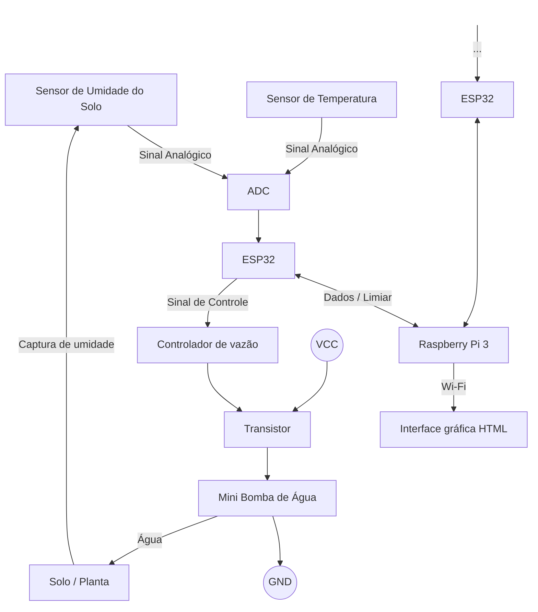
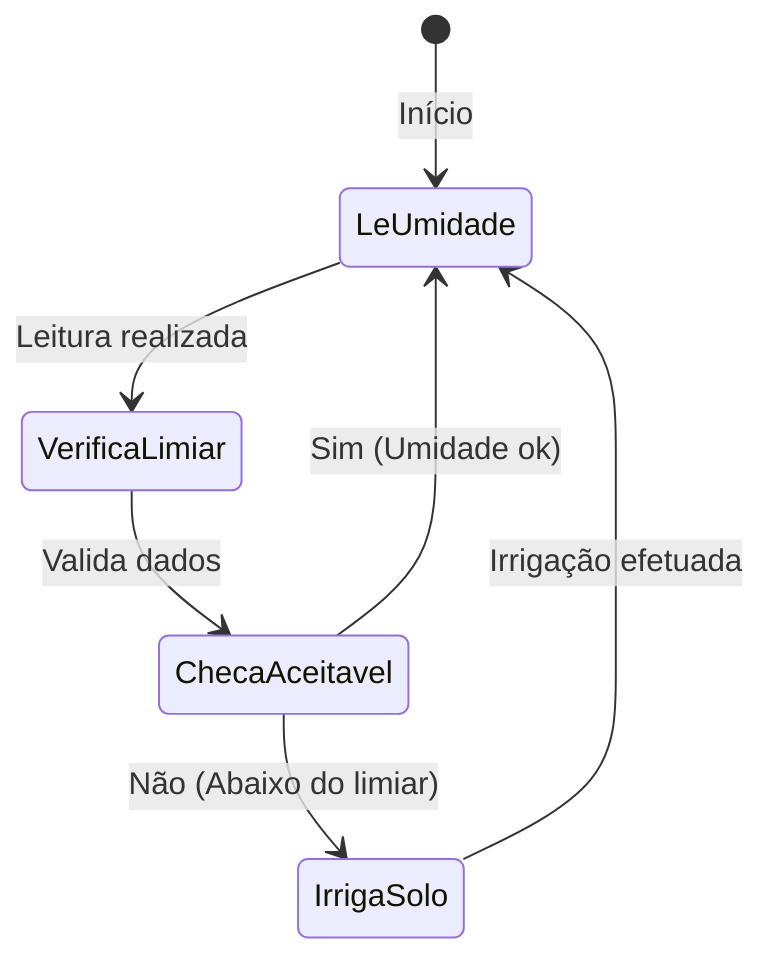

# Universidade de São Paulo - Escola Politécnica
## PCS3732 - Laboratório de Processadores

### **Projeto da disciplina:** Irrigador com monitoramento de umidade do solo

### Autores

| Nome | NUSP |
| :--- | :--- |
| André Yugo Inoue | 12551345 |
| Beatriz Barreto Tavora | 14560401 |
| João Victor Meneghelli Milanezi | 14583000 |
| Vinícius de Andrade Rosa | 14610991 |

---

## 1. Introdução

### Motivação / Justificativa
Com o objetivo de aplicar os conceitos e métodos aprendidos ao longo da disciplina PCS3732 em um contexto prático, o grupo decidiu como projeto um irrigador com monitoramento de umidade do solo. Através dele, pretende-se desenvolver um dispositivo que lide com necessidades práticas e econômicas. Seja na agricultura em pequena escala, no cultivo urbano ou em estufas, a irrigação manual ou baseada em horários fixos frequentemente comete dois erros opostos: a subirrigação, que estressa a planta e compromete seu desenvolvimento, e a superirrigação, que desperdiça recursos hídricos, expõe o solo à lixiviação de nutrientes e pode apodrecer as raízes.

O desenvolvimento de um irrigador automatizado com sensor de umidade de solo justifica-se pela busca de uma solução precisa e de baixo custo. Ao substituir o acionamento por horários predeterminados pelo monitoramento do estado real do substrato, o sistema garante que a água seja aplicada apenas quando e quanto a planta realmente necessita, otimizando o consumo de água e reduzindo o trabalho manual recorrente.

---

## 2. Objetivos do Projeto

### Objetivo Geral
Projetar e construir um sistema automatizado de irrigação de solo que utilize sensores de umidade para controlar de forma autônoma o acionamento de um atuador hídrico, mantendo o solo na faixa de umidade ideal para o cultivo.

### Objetivos Específicos
- Integrar um sensor de umidade ao microcontrolador para obter leituras em tempo real e calibrar os limiares críticos de solo seco e solo úmido.
- Desenvolver a rotina de controle responsável por interpretar os dados do sensor e tomar a decisão de ligar ou desligar o mecanismo de irrigação.
- Implementar temporizadores e travas no código para evitar acionamentos contínuos em caso de falha de leitura, impedindo o encharcamento acidental.
- Estruturar o circuito com foco em baixo consumo de energia e facilidade de manutenção, viabilizando o uso em ambientes de cultivo contínuo.

---

## 3. Requisitos

| Código | Nome do Requisito | Tipo | Descrição |
| :--- | :--- | :--- | :--- |
| **RF-1** | Monitoramento da Umidade do Solo | Funcional | O sistema deve realizar leituras periódicas do sensor de umidade para determinar o estado hídrico do solo. |
| **RF-2** | Monitoramento da Temperatura | Funcional | O sistema deve realizar leituras periódicas do sensor de temperatura. |
| **RF-3** | Definição de Limiar para Irrigação | Funcional | O sistema deve possibilitar que o usuário defina o limiar para irrigação. |
| **RF-4** | Irrigação Automática | Funcional | O sistema deve acionar automaticamente a bomba de água quando a umidade medida estiver abaixo de um limiar configurado. |
| **RF-5** | Visualização do Estado do Sistema | Funcional | O sistema deve disponibilizar ao usuário informações como nível de umidade, estado da bomba e histórico recente de leituras por meio de uma interface web ou display. |
| **RF-6** | Visualização de Série Temporal | Funcional | O sistema deve disponibilizar a série temporal das leituras em forma gráfica. |
| **RNF-1** | Tempo de Resposta | Não Funcional (Eficiência de Desempenho) | O sistema deve acionar a irrigação em até 5 segundos após detectar um nível de umidade inferior ao limiar configurado. |
| **RNF-2** | Confiabilidade Operacional | Não Funcional (Confiabilidade) | O sistema deve operar continuamente durante períodos prolongados sem falhas de leitura ou acionamento indevido da bomba. |
| **RNF-3** | Facilidade de Configuração | Não Funcional (Usabilidade) | O usuário deve conseguir alterar parâmetros como limiar de umidade e intervalo de amostragem sem necessidade de modificar o código-fonte. |
| **RNF-4** | Capacidade de expansão | Não Funcional (Escalabilidade) | O sistema deve ser capaz de ser expandido para acomodar novos módulos de irrigação. |

---

## 4. Arquitetura

O hardware do sistema é centrado no Raspberry Pi 3B+, que atua como unidade central de processamento, concentrando o broker de mensagens e a aplicação de backend. Nele se conectam, via Wi-Fi, módulos de irrigação compostos por ESP32-C3, sensores e atuadores. Os módulos publicam suas leituras e recebem configurações do Raspberry por meio do protocolo **MQTT**, que roda sobre a rede Wi-Fi/TCP-IP compartilhada por todos os dispositivos; o Raspberry, por sua vez, disponibiliza esses dados para o painel web (Streamlit) por meio de uma API REST consumida via **HTTP**. Por meio da mesma interface é possível definir limiares para irrigação para cada um dos módulos, informação esta que é transmitida pelo Raspberry ao ESP responsável pelo módulo de irrigação adequado. Nos módulos, sensores de umidade do solo e de temperatura fazem a leitura do nível de água no substrato da planta e temperatura e enviam o sinal analógico para um conversor analógico-digital, que por sua vez adequa o sinal para ser lido pelos pinos GPIO do ESP32. Para acionar uma das bombas de água, o ESP envia um sinal de controle através do controlador de vazão até a base de um transistor. O transistor funciona como uma chave eletrônica acionada pelo ESP, permitindo chavear a corrente da fonte de alimentação (VCC e GND) para ligar/desligar a bomba com segurança sem sobrecarregar a placa.

### 4.1 Protocolo de Comunicação

A comunicação entre os componentes do sistema ocorre em duas camadas distintas:

| Camada | Enlace físico | Protocolo de aplicação | Participantes |
| :--- | :--- | :--- | :--- |
| Firmware ↔ Backend | Wi-Fi (IEEE 802.11) | **MQTT** (sobre TCP/IP) | ESP32-C3 ↔ Raspberry Pi |
| Backend ↔ Painel web | Wi-Fi / rede local (IEEE 802.11) | **HTTP/REST** | Raspberry Pi ↔ Dashboard (Streamlit) |

Todos os dispositivos (módulos ESP32-C3 e Raspberry Pi) se conectam à mesma rede Wi-Fi local. O Wi-Fi atua apenas como o meio físico de transporte; a lógica de comunicação entre firmware e backend é implementada sobre o protocolo **MQTT**, enquanto o painel web consome os dados por meio de requisições **HTTP** periódicas à API REST.

**MQTT (Firmware ↔ Backend)**

O MQTT (*Message Queuing Telemetry Transport*) foi escolhido por ser um protocolo de mensageria leve, baseado no modelo publicação/assinatura (*publish/subscribe*) sobre TCP/IP, adequado para dispositivos remotos com banda de rede limitada — características compatíveis com os módulos ESP32-C3 conectados via Wi-Fi.

- **Broker:** Eclipse Mosquitto, containerizado via Docker Compose, executado no Raspberry Pi 3B+.
- **Tópicos utilizados:**

  | Tópico | Sentido | Conteúdo |
  | :--- | :--- | :--- |
  | `devices/{id}/status` | ESP32 → RPi | Mensagem *retained*, com *Last Will and Testament* (LWT) configurado, indicando online/offline do módulo |
  | `devices/{id}/sensors` | ESP32 → RPi | Leituras periódicas em JSON (umidade, temperatura e carimbo de tempo) |
  | `devices/{id}/config` | RPi → ESP32 | Mensagem *retained* com o novo limiar de umidade, publicada pela API ao processar uma atualização de configuração |

- **Mecanismos empregados:**
  - *Publish/Subscribe:* desacopla firmware e backend, permitindo que novos módulos sejam adicionados sem alterar o código do backend.
  - *QoS (Quality of Service):* garante níveis de confiabilidade na entrega das mensagens.
  - *Last Will and Testament (LWT):* permite que o broker detecte automaticamente a queda de conexão de um módulo, publicando uma mensagem de status "offline" em seu nome.
  - *Mensagens retained:* garantem que o último estado conhecido (status do dispositivo, limiar configurado) esteja sempre disponível para novos assinantes.

<em>Diagrama de arquitetura do projeto</em>

<em>Diagrama de transição de estados do projeto</em>

---

## 5. Testes

O projeto conta com testes para o backend, conexão de dispositivos e bomba de água. O primeiro cria um banco de dados em memória e testa as rotas; o segundo, checa a criação e listagem dos dispositivos (ESP32's); o terceiro, é um teste unitário que verifica a lógica de funcionamento da bomba para diferentes situações de umidade: abaixo do limiar (bomba deve ligar), entre o intervalo limiar+histerese (bomba deve se manter ligada), e acima da marca limiar+histerese (bomba deve desligar). Além disso, o último teste também simula caso de erro de leitura.